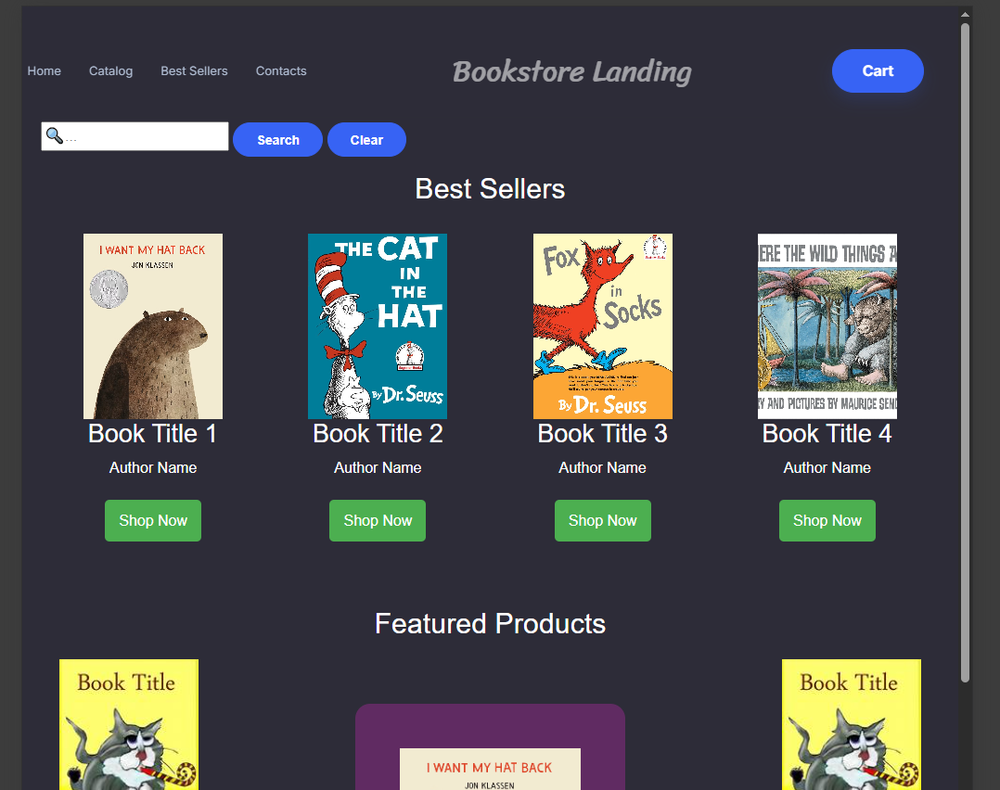

# project1: Bookstore Landing

Group 3: "Sarah Jarosz"

Staff: Austin

    Phongsavath, Thida

    Makousky, Christopher

    Ranatunga, Kalana

    Edwards, Devin

    Resick, Brody

DESCRIPTION

An online bookstore where the user can stay up to date on the latest poplar books. Search our extensive catalogue with our intuative search feature. Select one of the featured items and press "Shop Now" to view detailed product information. Add the desired books to the shopping cart and proceed to checkout!

TECHNOLOGIES USED

Bootstrap studio was used to assist in constructing the html elements and styles for this website.

SCREENSHOT

DEPLOYED APPLICATION

https://cmakousky.github.io/project1

OLD PRODUCTION INFO

Wireframe Ideas
1. Header and Footer Style from Brody
2. Be able to click on small product image to get more information, such as in Christopher's wireframe draft.
3. Be able to scroll through different categories with cursor. See Kalana's example. This may be more of a mobile feature. Consider developing primarily for mobile.
4. Have a special page for educators. See Kalana's example.

Delegation of tasks

Christopher - Feature: Click on small image, image enlarges to more info like description. Implement ability to add selected product to cart.
              Features Completed: Click on "Learn More" button to bring up product info.
                                  Click on "Add to Cart" button to add the selected book to the cart in local storage.

Brody - Featured Products/ Best Sellers

Thida - Nav Bar/Footer maybe

Kalana - Search Bar/Advanced Gear icon